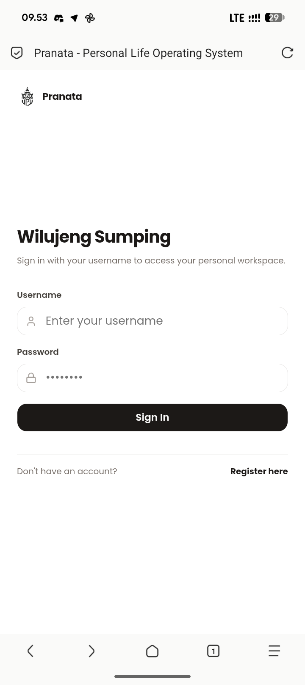
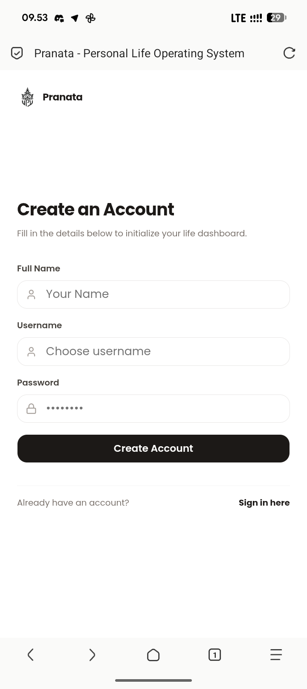
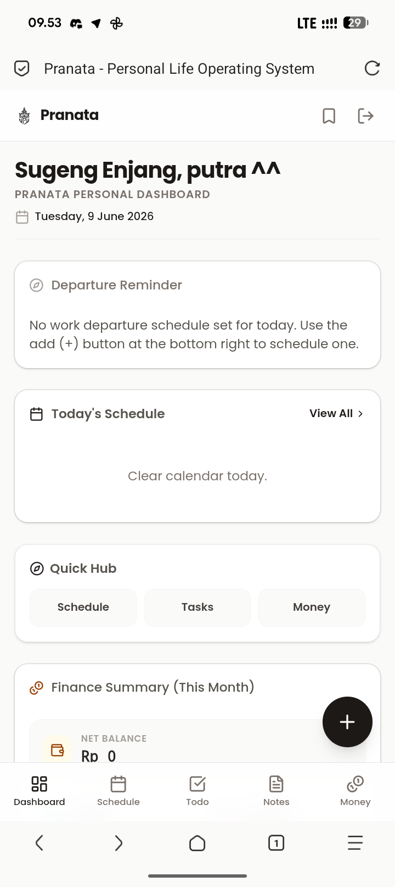
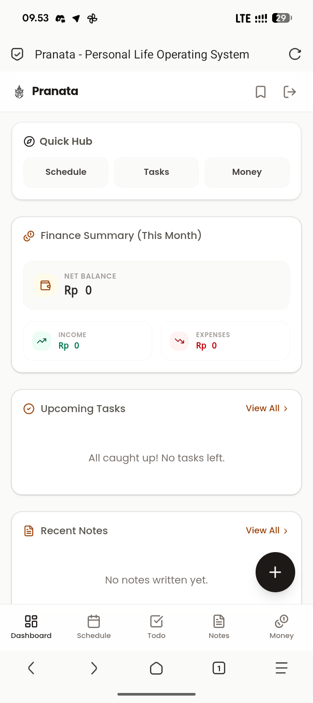
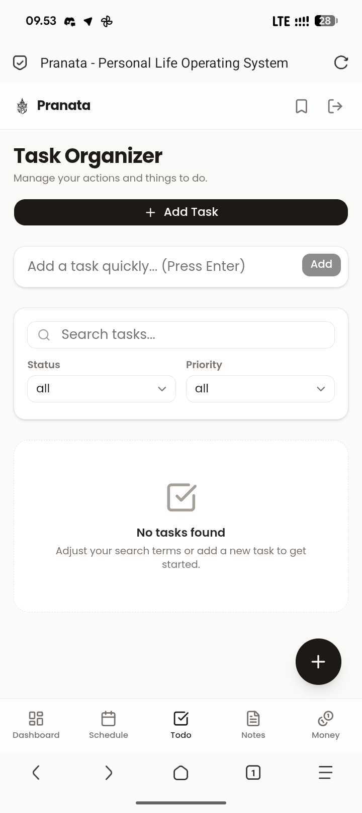
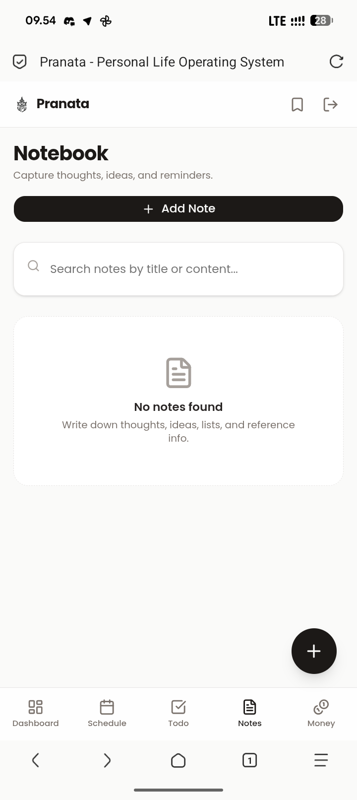
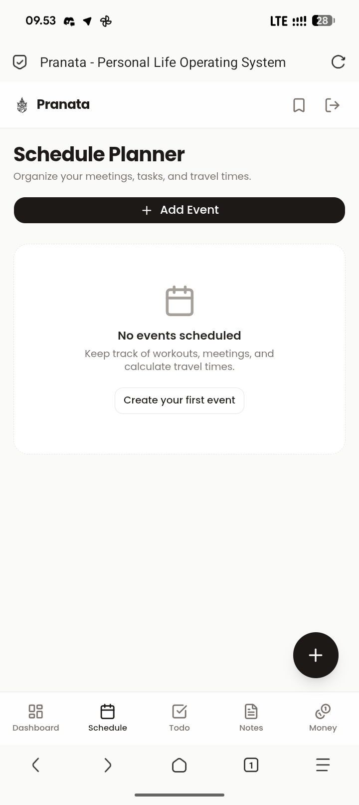
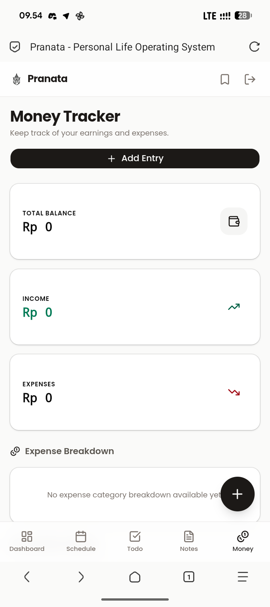
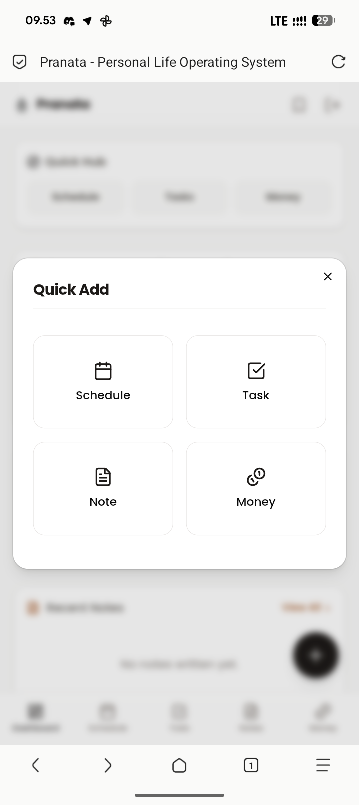

<div align="center">
  

  # Pranata

  ### Personal Productivity Workspace

  *A beautiful, premium, mobile-first workspace designed with a Javanese-inspired high-contrast monochrome aesthetic.*

  [](LICENSE)
  [](https://nextjs.org/)
  [](https://supabase.com/)
  [](https://tailwindcss.com/)

  [Key Features](#key-features) • [Screenshots](#screenshots-gallery) • [Technology Stack](#technology-stack) • [Security](#security-architecture) • [Local Setup](#local-development-guide-building--running) • [Contribution](#contribution-guidelines)
</div>

---

Pranata is a modern personal productivity dashboard designed for seamless task orchestration, finance tracking, and schedule organization. Built from the ground up to be mobile-first, lightweight, and completely free under the MIT license.

## Key Features

*   **Javanese Greeting Header**: Custom greeting algorithm rendering Javanese welcomes (*Sugeng Enjang*, *Wilujeng Siang*, *Sugeng Sonten*, *Sugeng Dalu*) depending on the hour of the user's selected timezone.
*   **Smart Departure Calculator**: Computes exact departure alarms dynamically based on work start times, travel durations, and custom traffic buffers:
    $$\text{Departure Time} = \text{Work Start Time} - \text{Travel Duration} - \text{Traffic Buffer}$$
*   **Timezone Settings (Manual/Auto)**: Choose between automatic browser-based timezone detection and manual timezone selections (WIB, WITA, WIT, UTC, SGT, EST, PST, etc.) to keep Javanese greetings, notifications, and scheduled events in sync with your local hour.
*   **Flexible Recurring Windows**: Fine-tune weekly schedules with optional start/end active date ranges and custom skipped dates (exception dates) for holidays or vacation times.
*   **Bulk Schedule Import**: Instantly paste formatted lists of activities (e.g., `06.15 - 06.30 Shower`, one per line) to bulk-populate your routine or dated planner.
*   **Task Timer & Countdown**: Set optional start and end times for checklist items to see real-time pulsing **● Active Now** badges and dynamic countdowns. Toggle tasks to `in_progress` quickly with Play/Pause icons.
*   **Recurring Weekly Schedules**: Define schedules that repeat on specific days of the week (e.g. Monday through Friday) without needing a fixed date, ideal for work shifts and study routines.
*   **Schedule Done Tracking**: Mark events as completed with an optimistic-update toggle. Recurring templates can be completed specifically *for today*, leaving future weekly repetitions active.
*   **Configurable Event Reminders**: Attach browser notifications to any schedule event with lead times of 5, 15, 30, or 60 minutes before the start time.
*   **Time-bound Browser Alerts**: Schedules real-time local browser notifications to trigger exactly when you need to leave or when an event reminder fires.
*   **Checklist Todo Tracker**: Modular lists with priority tags (`high`, `medium`, `low`) and optimistic client state overrides.
*   **Notebook**: Minimalist card-based notebook with automated category extraction headers.
*   **Personal Finance Ledger**: Interactive tracker to record monthly income and expenses with aggregate budget ratio meters.
*   **Reference Vault**: Secure bookmark repository for courses, reference links, and documentation tags.

---

## Screenshots Gallery

<details>
<summary><b>Click to expand screenshots</b></summary>

### Authentication
| Login | Register |
| :---: | :---: |
|  |  |

### Home Dashboard
| Main Interface | Departure Alerts |
| :---: | :---: |
|  |  |

### Modules
| Task Organizer | Notebook |
| :---: | :---: |
|  |  |

| Schedule Planner | Money Tracker |
| :---: | :---: |
|  |  |

### Actions
| Quick Add Menu |
| :---: |
|  |
</details>

---

## Technology Stack

Pranata is engineered using standard web compilation libraries:

| Layer | Technology |
| :--- | :--- |
| **Framework** | Next.js 16 (App Router) |
| **Language** | TypeScript |
| **Database** | Supabase (PostgreSQL) |
| **Styling** | Tailwind CSS & Lucide Icons |
| **Form Handler** | React Hook Form & Zod Validation |
| **Date Parser** | Date-fns |

---

## Security Architecture

> [!IMPORTANT]
> **Database Security Boundary**: Row Level Security (RLS) is strictly enforced across all PostgreSQL tables. All reads, updates, and deletes verify `auth.uid() = user_id`. Database triggers handle secure auto-profile creation under a `security definer` execution context.

1.  **JWT Router Middleware Protection**: Sessions are checked at the edge before static routes are rendered, safeguarding private pages.
2.  **SQL Injection Shielding**: Database interactions leverage Supabase parameterization, neutralizing injection vectors.
3.  **Automatic Cascade Deletion**: Foreign key constraints automatically clean up nested tables upon account deletion.

---

## Local Development Guide (Building & Running)

### Prerequisites
- Node.js (v18+)
- Supabase project credentials

### Step-by-Step Setup
1.  **Clone the Repository**:
    ```bash
    git clone https://github.com/putraaxzy/pranata.git
    cd pranata
    ```
2.  **Install Dependencies**:
    ```bash
    npm install
    ```
3.  **Configure Environment Variables**:
    Create a `.env.local` file in the root directory:
    ```env
    NEXT_PUBLIC_SUPABASE_URL=your_supabase_project_url
    NEXT_PUBLIC_SUPABASE_ANON_KEY=your_supabase_anon_key
    ```
4.  **Migrate Database**:
    Execute the PostgreSQL script inside [supabase/schema.sql](supabase/schema.sql) in your Supabase SQL Editor.

### Build Commands
- **Local Dev Server**: `npm run dev`
- **Compile Production Bundle**: `npm run build`
- **Run Production Server**: `npm run start`

---

## Codebase Directory Structure

```
├── app/               # Next.js App Router paths
│   ├── (app)/         # Authenticated layouts and workspace pages
│   ├── auth/          # Authentication screens
│   └── globals.css    # Global CSS definitions
├── components/        # Reusable React components
│   ├── dashboard/     # Home panel widgets
│   ├── forms/         # Data creation forms
│   └── ui/            # Base UI primitives (dialog, button, input)
├── lib/               # Utilities & database connection factories
├── public/            # Static media (emblems, SVG icons)
└── supabase/          # Database definitions & migrations
```

---

## Contribution Guidelines

We welcome pull requests! To contribute:

1.  **Fork the Repository** to your own GitHub account.
2.  **Create a Feature Branch** (`git checkout -b feature/amazing-feature`).
3.  **Adhere to Code Standards**:
    - Build concurrency flows using `Promise.all` to prevent waterfalls.
    - Write type-safe TypeScript.
    - Always validate form data with Zod schemas.
4.  **Commit with Sign-off**:
    ```bash
    git commit -sm "feat: add amazing feature"
    ```
5.  **Open a Pull Request** describing your changes.

---

## License

This project is licensed under the [MIT License](LICENSE) free to copy, modify, distribute, and build upon.
